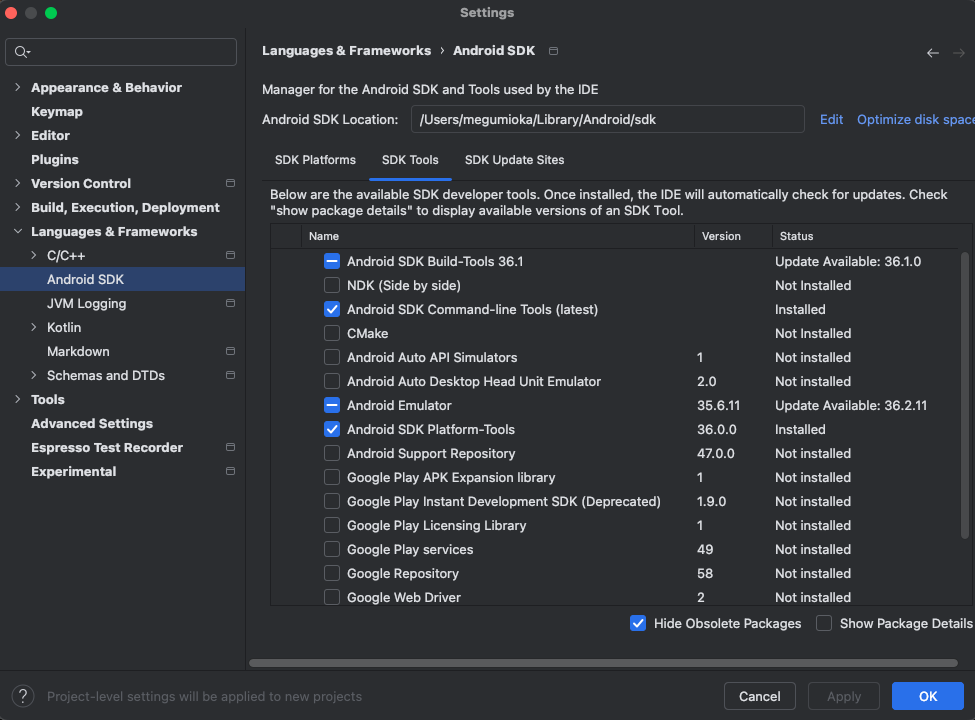
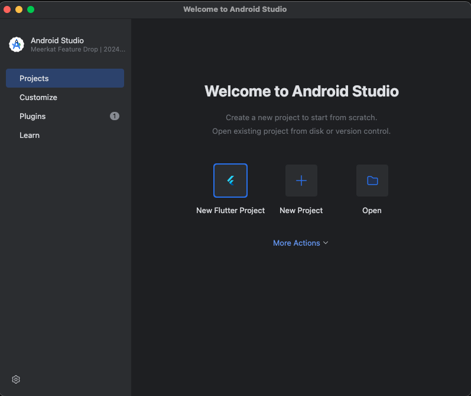
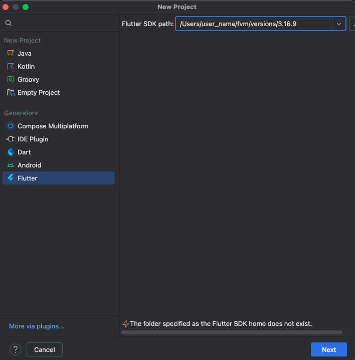
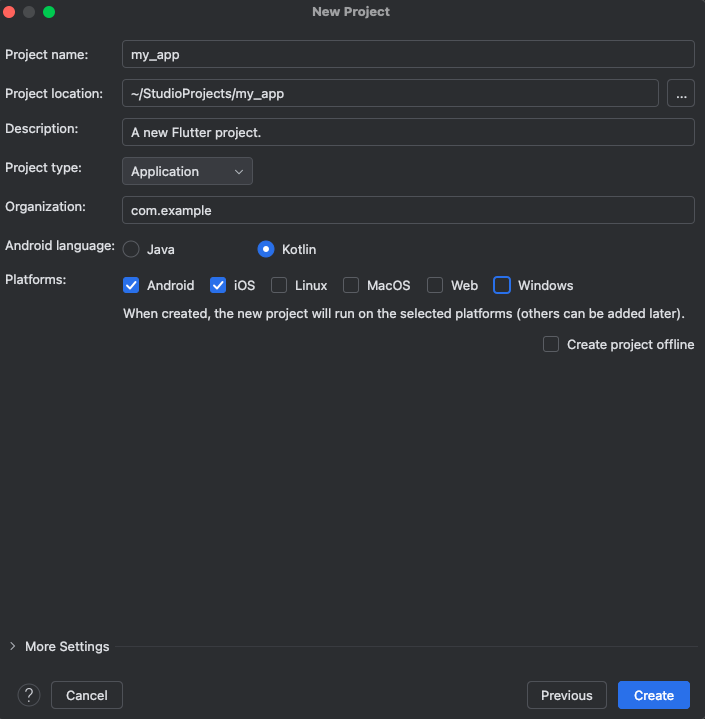
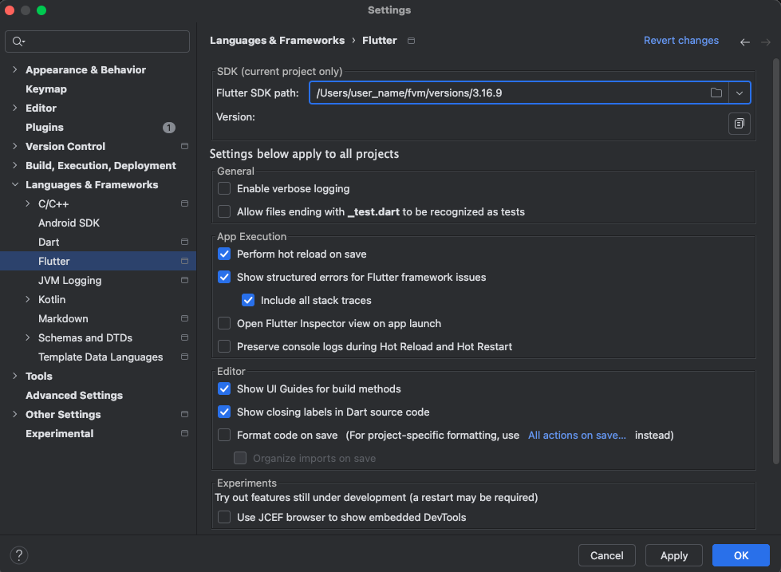

# レポジトリ概要

- Flutterの開発練習用レポジトリ
- 書籍([Flutter実践開発 ── iPhone／Android両対応アプリ開発のテクニック](https://amzn.asia/d/hNnVHlu))を利用した練習コードです。

# brew install
[direnv]()
[fvm]()


# Flutterのインストール


- [公式の手順](https://docs.flutter.dev/get-started/quick#install)

## VSCodeの拡張機能の追加
- [Dart-Code.flutter](https://marketplace.visualstudio.com/items?itemName=Dart-Code.flutter)

## 新規プロジェクトの作成
1. `Cmd`+`Shift`+`p`
2. `Flutter`で検索
3. `Flutter: New Project`を選択
4. プロジェクト直下にインストール


## パスの追加
プロジェクト直下にインストールしたFlutter SDKをパスに追加する。
プロジェクト内だけでパスを追加したいので、direnvを使う。

プロジェクト直下に.envrcを作成し、以下を記載する。
```sh
export PATH="/flutter/bin:$PATH"
```

```sh
direnv allow
```

## Rosetta2のインストール
```sh
sudo softwareupdate --install-rosetta --agree-to-license
```
パスワードを求められるので、ユーザのパスワードを入力→Enter

## Flutterがインストールできたことの確認
```
flutter --version
```

# プラットフォームごとの環境構築

## Android Studioのインストール

## Android toolchainのインストール

Android Studio>Settings>Languages & Framgeworks>Android SDK>SDK ToolsでAndroid SDK Command-line Toolsをインストール


## 開発環境の情報を出力
```sh
flutter doctor
```
出力結果
```sh
Doctor summary (to see all details, run flutter doctor -v):
[✓] Flutter (Channel stable, 3.35.6, on macOS 15.7.1 24G231 darwin-arm64, locale ja-JP)
[!] Android toolchain - develop for Android devices (Android SDK version 35.0.1)
    ! Some Android licenses not accepted. To resolve this, run: flutter doctor --android-licenses
[✓] Xcode - develop for iOS and macOS (Xcode 26.0.1)
[✓] Chrome - develop for the web
[✓] Android Studio (version 2024.3)
[✓] VS Code (version 1.104.0)
[✓] Connected device (2 available)
[✓] Network resources

! Doctor found issues in 1 category.
```

出力のとおり、以下のコマンドを実行する。
```sh
flutter doctor --android-licenses
# 途中、yを2回選択
```


再度`flutter doctor`すると、以下のとおりの出力となり、警告は全て解消した。

```sh
Doctor summary (to see all details, run flutter doctor -v):
[✓] Flutter (Channel stable, 3.35.6, on macOS 15.7.1 24G231 darwin-arm64, locale ja-JP)
[✓] Android toolchain - develop for Android devices (Android SDK version 35.0.1)
[✓] Xcode - develop for iOS and macOS (Xcode 26.0.1)
[✓] Chrome - develop for the web
[✓] Android Studio (version 2024.3)
[✓] VS Code (version 1.104.0)
[✓] Connected device (2 available)
[✓] Network resources
```

# fvmによる Flutterのバージョン管理

## fvmのインストール
fvmのGitHubレポジトリを Homebrewに追加
```sh
brew tap leoafarias/fvm
```

fvmをインストール
```sh
brew install fvm
```

## Flutterのインストール
インストール可能なFlutterバージョンを出力
```sh
fvm releases
```

3.16.9をインストール
```sh
fvm install 3.16.9
fvm use 3.16.9
```

バージョンを確認
```sh
fvm flutter --version
fvm dart --version
```

~/.zshrcにエイリアスを登録し、fvmの入力を省略する
```sh
#~/.zshrc
alias flutter="fvm flutter"
```

# Android Studioの設定

## Flutterプロジェクトの作成
新規プロジェクト作成

FlutterのSDKを選択

プロジェクト名を編集


## FlutterのSDKを設定
SettingsからAndroid Studioが参照するFlutter SDKのパスを設定する


## Android Studioでシミュレーターのインストール

- Android, iOSのEmulatorをインストールし、起動できるようにしておく。

## .dartの実行方法

```sh
fvm dart *.dart
```